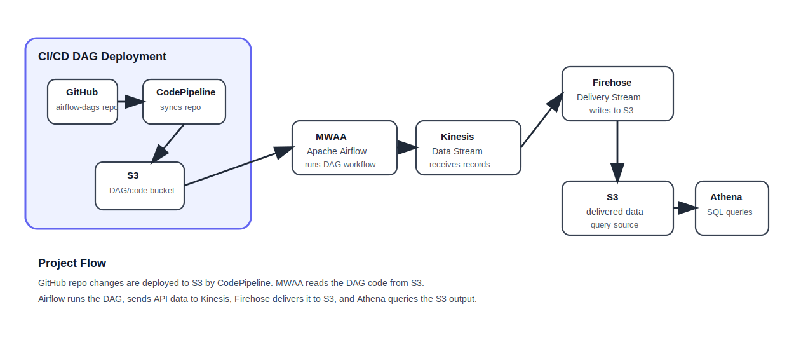

# Airflow and AWS CodePipeline Dataflow Project

This project demonstrates a cloud-based dataflow pipeline using GitHub, AWS CodePipeline, Amazon S3, Amazon MWAA / Apache Airflow, Amazon Kinesis Data Streams, Amazon Kinesis Firehose, and Amazon Athena.

## Architecture




## Project Overview

The project begins by forking an Airflow DAG repository into a personal GitHub account. AWS CodePipeline is then configured to automatically sync the repository contents into an S3 bucket. That S3 location is later used by Amazon MWAA / Airflow to run DAGs.

The broader pipeline follows this flow:

```text
GitHub Repository
→ AWS CodePipeline
→ S3 bucket for DAG sync
→ Amazon MWAA / Apache Airflow
→ Amazon Kinesis Data Streams
→ Amazon Kinesis Firehose
→ Amazon S3 data storage
→ Amazon Athena
```

## Current Status

- [x] GitHub fork created
- [ ] S3 buckets created
- [ ] CodePipeline created
- [ ] Code synced from GitHub to S3
- [ ] MWAA / Airflow setup
- [ ] Kinesis setup
- [ ] Athena query validation
- [ ] Cleanup completed

## Main Learning Goals

- Understand how Airflow DAG code can be deployed through CodePipeline
- Understand how AWS services connect in a streaming-style dataflow
- Understand the role of S3 in both DAG deployment and data storage
- Understand how Athena queries data stored in S3

## Services Used

| Service | Role |
|---|---|
| GitHub | Stores Airflow DAG source code |
| AWS CodePipeline | Syncs GitHub source code into S3 |
| Amazon S3 | Stores Airflow DAG files and later data output |
| Amazon MWAA / Airflow | Runs DAG workflows |
| Kinesis Data Streams | Receives streaming records |
| Kinesis Firehose | Delivers records to S3 |
| Athena | Queries S3 data using SQL |
